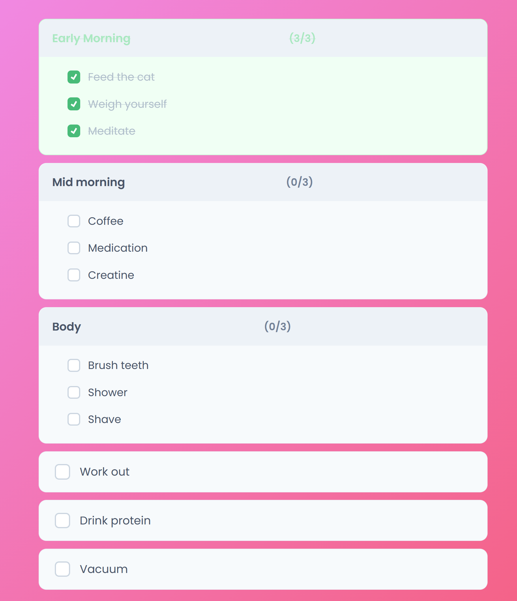

## About

Momentum is a simple application for tracking tasks I need to do every day. It automatically resets each night.

Tasks can be individual or grouped them together in habit stacks. I deploy this in my homelab and make it available on the network so any device in my home can be used to update the status. 

### Screenshot 


## Key Features

*   **Task & Habit Stacks:** Define simple tasks or break down habits into discrete steps (e.g., "Meditate + Exercise + Read")
*   **Persistent State:** Daily completion state stored in JSON format, mounted as a volume for data durability
*   **Timezone-Aware:** Configured reset timezone (`TIMEZONE` env var) ensures the daily reset happens at the right time for your location
*   **Fast & Lightweight:** Built in Go with zero external dependencies (uses only stdlib), resulting in a tiny, efficient container
*   **Dynamic Configuration:** Load tasks from `config.json` (file-based) or `DAILY_TASKS` environment variable (container-friendly)
*   **Container-First:** Multi-stage Docker build produces a minimal scratch-based image (~5MB)
*   **Kubernetes Ready:** Includes manifests for Deployment, Service, PersistentVolumeClaim, and ConfigMap

## Task Configuration

Tasks can be configured in two ways:

### 1. File-based (`config.json`)
```json
{
  "DailyTasks": [
    "Morning: Make bed + Brush teeth + Cold shower",
    "Single task",
    "Mind: Meditate + Journal + Read"
  ],
  "TimeZone": "America/New_York"
}
```

### 2. Environment variables (for containers)
```bash
DAILY_TASKS="Task 1,Task 2,Morning: Coffee + Meditate"
TIMEZONE="America/Los_Angeles"
```

#### Task Format
- **Simple task:** `"Task name"` → displays as a single checkbox
- **Unnamed habit stack:** `"Step 1 + Step 2 + Step 3"` → displays as a progress bar with individual steps
- **Named habit stack:** `"My Morning: Step 1 + Step 2"` → named stack with steps
- **Comma-separated:** Multiple tasks in `DAILY_TASKS` are split by comma

